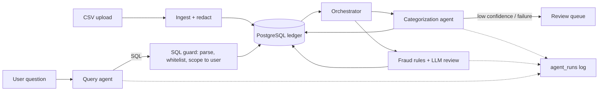

# Finance Copilot

An AI-assisted finance back office for small businesses. Upload a bank statement and it categorizes each transaction with an LLM, flags suspicious ones with deterministic rules plus an LLM second opinion, and answers plain-English questions ("How much did we spend on software last month?") by writing SQL that is validated before it runs.

Built as a learning project with a focus on the parts that make AI features safe to ship: validated structured output, retries and fallbacks, redaction before any LLM call, and SQL guardrails.

## What it does

| Area | Implementation |
|---|---|
| Ledger | Double-entry model in PostgreSQL: users, accounts, transactions, transaction lines. Debits must equal credits (checked in the API and constrained in the database). |
| Auth and isolation | bcrypt password hashing, JWT sessions, every query scoped to the signed-in user. |
| Ingestion | CSV upload with per-row validation. Bad rows are reported, good rows are kept. Duplicate files are rejected by checksum. The raw file is never stored. |
| Redaction | Account numbers, emails, UPI ids, card numbers and similar are stripped before storage and again before every LLM call. A test asserts a known account number never reaches an LLM payload. |
| Categorization agent | Structured JSON output validated with Pydantic, one corrective retry, low confidence goes to manual review (never a silent guess). Results for repeat vendors are cached so they skip the LLM. |
| Fraud and anomaly checks | Duplicate charges, same-day velocity, and statistical outliers (z-score). Borderline cases get an LLM review (confirm, dismiss, escalate). Every flag carries a readable reason. |
| Query agent | Tool-calling loop around a `run_sql_query` tool. SQL is parsed with `sqlglot`: one SELECT only, whitelisted tables, no unknown functions, every table rewritten to the user's own rows, row limit enforced. Unsafe SQL gets "I couldn't answer that safely", never a guess. |
| Orchestrator | `pending -> categorize -> fraud checks`. Transient LLM errors retry with exponential backoff. Anything that cannot be categorized lands in a visible review queue with a logged reason. |
| Observability | Every agent call is stored in `agent_runs` (input, output, tries, latency, tokens). Audit log for user actions. Rate limits on ingest, pipeline and query endpoints. |
| UI | Single-page app served by FastAPI: transactions, review queue, flags, chat, agent log. |



## Run it

You need Docker. An Anthropic API key is optional: without one, fraud rules and the ledger still work, and transactions go to the review queue.

```bash
cp .env.example .env        # add ANTHROPIC_API_KEY and a long random JWT_SECRET
docker compose up --build
```

Open http://localhost:8001, create an account, upload `sample_data/synthetic_transactions.csv`, then choose "Categorize and check". API docs are at http://localhost:8001/docs.

The sample file is synthetic, with planted anomalies (a duplicate AWS bill, a 48,000 ride among ordinary ones, a burst of food orders, an account number in a description) and one malformed row to show partial-failure handling.

Running without Docker for the app (Postgres still in Docker):

```bash
docker compose up -d db
cd backend
python -m venv .venv && source .venv/bin/activate     # Windows: .venv\Scripts\Activate.ps1
pip install -r requirements-dev.txt
cp ../.env.example .env
uvicorn main:app --reload --port 8001
```

## Tests

```bash
cd backend && pytest -q
```

46 tests, with the LLM replaced by a fake client, so they are free and repeatable. They cover redaction, the SQL guard (including injection attempts), the retry and fallback paths, fraud rules against planted anomalies, user isolation, partial CSV failure, rate limiting, and the full pipeline through the API. CI runs them on every push. The suite uses SQLite; the read-only transaction and statement timeout in the query agent only apply on PostgreSQL.

## Layout

```
backend/
  main.py  config.py  db.py  models.py  schemas.py  security.py
  redaction.py  sql_guard.py  llm.py  categorizer.py  ingest.py  ledger.py
  agents/   categorization.py  fraud.py  query.py  orchestrator.py
  routers/  auth.py  ledger.py  pipeline.py  query.py
  static/   index.html
  tests/
sample_data/synthetic_transactions.csv
```

## Not built yet

Being direct about the gaps:

- Frontend is plain HTML and JavaScript, not React or Next.js.
- Statements must be CSV. No PDF parsing or OCR.
- No recurring-payment detection and no PDF report export.
- Tables are created at startup, not managed with Alembic migrations.
- Not deployed yet.
- No Postgres row-level security or dedicated read-only database role (the guard rewrites queries instead), no column-level encryption at rest, and no real-time pipeline status.

## Cost

The default model is Claude Haiku 4.5. Categorizing is roughly a tenth of a cent per new vendor, and repeat vendors are free thanks to the cache. `POST /pipeline/run` processes at most 200 transactions per call by default.
